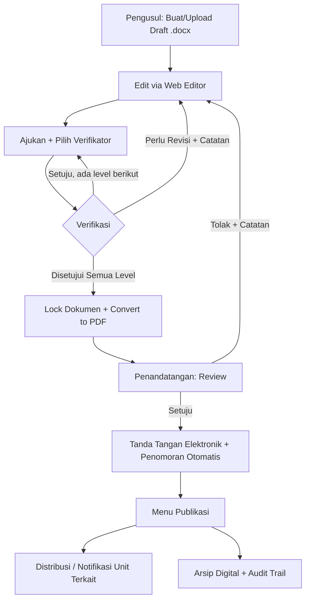
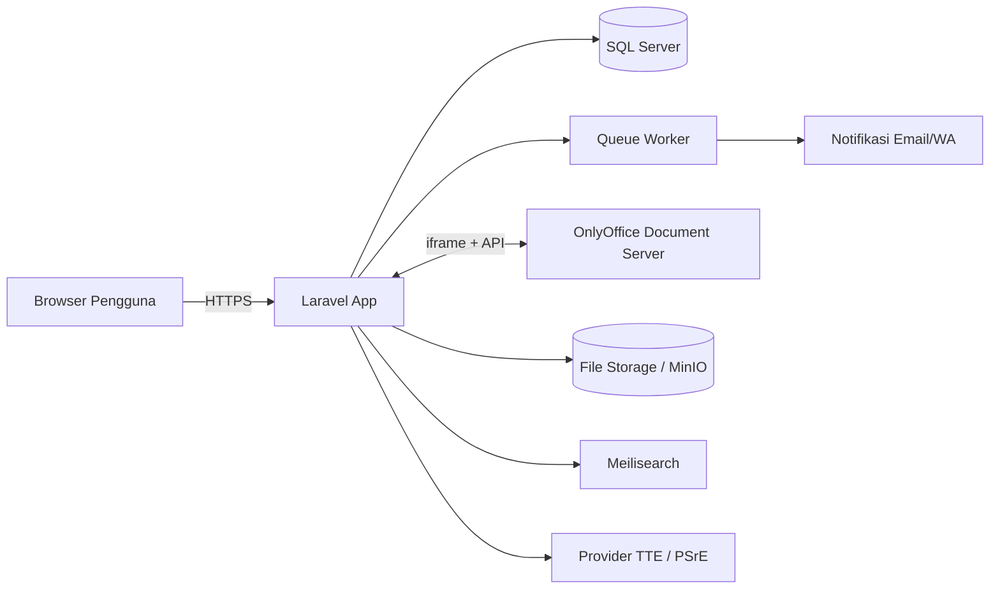

# PRD / BRD — Sistem Informasi Persuratan Elektronik Rumah Sakit
**Nama Kerja Proyek:** SIMPEL-RS (Sistem Informasi Manajemen Persuratan Elektronik Rumah Sakit)
*(nama sementara, silakan sesuaikan dengan branding rumah sakit)*

| | |
|---|---|
| **Versi** | 0.1 — Draft awal (modal prompting) |
| **Tanggal** | 25 Juli 2026 |
| **Jenis Dokumen** | Product Requirements Document (PRD) + Business Requirements Document (BRD) |
| **Referensi Konsep** | Tata Kelola Persuratan Elektronik Rumah Sakit |
| **Status** | Draft — untuk dikembangkan lebih lanjut / dipakai sebagai prompt awal pengembangan |

---

## Daftar Isi
1. Ringkasan Eksekutif
2. Latar Belakang & Masalah Bisnis
3. Tujuan
4. Prinsip Desain: Fleksibilitas & Konfigurabilitas
5. Ruang Lingkup
6. Definisi & Istilah
7. Peran Pengguna (Aktor)
8. Jenis Naskah Dinas
9. Alur Proses Bisnis
10. Status / State Dokumen
11. Kebutuhan Fungsional
12. Kebutuhan Non-Fungsional
13. Pertimbangan Regulasi & Kepatuhan (Indonesia)
14. Perbandingan Editor Docx Berbasis Web
15. Perbandingan Opsi Tanda Tangan Elektronik
16. Arsitektur Teknis
17. Rancangan Skema Data (High-Level)
18. User Stories Utama
19. Modul / Halaman Utama
20. Roadmap Pengembangan (MVP & Fase Lanjutan)
21. Risiko & Mitigasi
22. Asumsi & Ketergantungan
23. Kriteria Penerimaan MVP
24. Lampiran & Referensi

---

## 1. Ringkasan Eksekutif

SIMPEL-RS adalah aplikasi berbasis web (Laravel + SQL Server) untuk digitalisasi proses **persuratan dan pengesahan dokumen** di lingkungan rumah sakit yang disesuaikan dengan konteks tata kelola rumah sakit (termasuk kebutuhan akreditasi, kerahasiaan, dan struktur jabatan medis-non medis).

Alur inti: **Upload (.docx) → Pilih Verifikator → Verifikasi/Revisi (edit langsung via web) → Naik ke Penandatangan → Tanda Tangan Elektronik → Publikasi & Arsip.**

Dokumen ini menjadi *modal awal* (starting spec) untuk proses prompting ke AI coding assistant (mis. Claude Code) maupun untuk didiskusikan dengan tim/manajemen RS sebelum development dimulai.

---

## 2. Latar Belakang & Masalah Bisnis

Kondisi umum proses persuratan manual/semi-manual di rumah sakit:

- Draft surat dikirim bolak-balik lewat **WhatsApp/email**, tidak ada versi tunggal yang menjadi *source of truth* → rawan salah versi.
- **Bottleneck tanda tangan** pejabat (Direktur/Kabid/Kabag) yang sering dinas luar/cuti, tidak ada mekanisme delegasi yang tercatat rapi.
- Tidak ada **jejak audit** siapa mengoreksi apa dan kapan — menyulitkan **akreditasi RS (KARS)** yang mensyaratkan bukti pengesahan dokumen (SK, SPO, Panduan) yang jelas dan tertelusur.
- Penomoran surat manual rawan **duplikasi/tabrakan nomor**.
- Dokumen fisik yang sudah ditandatangani basah sulit diverifikasi keasliannya, mudah dipalsukan/diedit ulang.
- Tidak ada standar pusat penyimpanan/arsip digital, dokumen tersebar di komputer/unit masing-masing.

---

## 3. Tujuan

1. Mendigitalkan proses pengajuan, verifikasi, revisi, pengesahan, dan publikasi naskah dinas RS.
2. Menyediakan **satu sumber kebenaran** (single source of truth) untuk setiap dokumen beserta riwayat revisinya.
3. Memungkinkan **edit dokumen .docx langsung di browser** tanpa perlu unduh-edit-unggah ulang.
4. Menjamin **keabsahan hukum** dokumen melalui tanda tangan elektronik sesuai UU ITE.
5. Menyediakan **jejak audit lengkap** untuk kebutuhan akreditasi dan investigasi internal.
6. Mempercepat siklus persetujuan melalui mekanisme **delegasi/pelimpahan wewenang** saat pejabat berhalangan.
7. Menjadi pusat **arsip digital** yang bisa dicari (searchable) dan diberi retensi sesuai kebijakan kearsipan.

---

## 4. Prinsip Desain: Fleksibilitas & Konfigurabilitas

Karena tiap RS punya struktur birokrasi berbeda, sistem **wajib dirancang configurable**, bukan hard-coded:

- **Alur verifikasi & penandatangan per jenis dokumen** dapat diatur admin: 1 level atau berjenjang (mis. Kasubbag → Kabag → Direktur).
- **Pemilihan verifikator**: bisa bebas dipilih pengaju dari daftar yang berwenang, atau dibatasi otomatis sesuai unit kerja pengaju (routing rule).
- **Template & format nomor surat** per jenis naskah & unit dapat dikonfigurasi (lihat §11.6).
- **SLA waktu per tahap** (mis. verifikator harus merespons ≤2 hari kerja) dapat diset dan memicu reminder/eskalasi otomatis.
- **Delegasi wewenang** sementara (Plt./Plh.) bisa diaktifkan admin/pejabat tanpa mengubah struktur organisasi permanen di sistem.
- **Jenis tanda tangan elektronik** (tersertifikasi vs tidak tersertifikasi) dapat berbeda per jenis dokumen sesuai tingkat risiko hukumnya.

---

## 5. Ruang Lingkup

**Termasuk (in-scope):**
- Manajemen naskah dinas internal & keluar (SK, SOP/SPO, Surat Edaran, Nota Dinas, Surat Tugas, Undangan, dll.)
- Editor dokumen .docx berbasis web
- Workflow verifikasi berjenjang + revisi
- Tanda tangan elektronik
- Penomoran otomatis
- Publikasi & arsip digital
- Audit trail & pelaporan

**Tidak termasuk (out-of-scope, fase awal):**
- Rekam Medis Elektronik (RME) — domain terpisah, tunduk pada regulasi rekam medis yang berbeda (Permenkes RME) dan **tidak boleh dicampur** dengan sistem ini.
- Sistem penggajian/kepegawaian (HRIS) — cukup diintegrasikan sebagai sumber data master pegawai/jabatan.
- E-procurement / SIMRS klinis lainnya.
- (Opsional fase lanjut) Integrasi dengan SATUSEHAT/SIMRS untuk single sign-on.

---

## 6. Definisi & Istilah

| Istilah | Penjelasan |
|---|---|
| Pengusul/Pemohon | Staf yang mengunggah & mengajukan dokumen |
| Verifikator | Pejabat/staf yang mengoreksi kesesuaian isi/format dokumen |
| Penandatangan | Pejabat berwenang yang mengesahkan dokumen (TTE) |
| TTE | Tanda Tangan Elektronik |
| PSrE | Penyelenggara Sertifikasi Elektronik (penerbit sertifikat digital untuk TTE tersertifikasi) |
| BSrE | Balai Sertifikasi Elektronik di bawah BSSN (PSrE milik pemerintah) |
| Naskah Dinas | Istilah resmi untuk surat/dokumen administratif kedinasan |
| Plt./Plh. | Pelaksana Tugas / Pelaksana Harian — pejabat pengganti sementara |
| SLA | Service Level Agreement, batas waktu maksimal suatu tahap |

---

## 7. Peran Pengguna (Aktor)

| Peran | Deskripsi | Hak Akses Utama |
|---|---|---|
| **Super Admin** | IT/Tata Usaha pusat | Kelola master data, role, workflow, template, unit kerja |
| **Admin Unit** | Admin di tiap unit/bagian | Kelola pengguna & template di unitnya |
| **Pengusul** | Staf pembuat dokumen | Upload/edit draft, pilih verifikator, ajukan, revisi |
| **Verifikator** (multi-level, dapat >1 tahap) | Mengoreksi isi/redaksi | Approve / minta revisi + catatan, edit ringan (opsional), lihat riwayat versi |
| **Penandatangan** | Pejabat berwenang mengesahkan | Tanda tangan elektronik / tolak dengan alasan |
| **Publikator** | Admin humas/TU | Mengelola tampilan publikasi & distribusi |
| **Auditor/Pimpinan (read-only)** | Mis. Direktur, Komite Akreditasi | Lihat status & histori seluruh dokumen (tanpa edit) |
| **Delegasi (Plt./Plh.)** | Pengganti sementara | Hak sama dengan pejabat yang digantikan, selama periode aktif |

---

## 8. Jenis Naskah Dinas (contoh, disesuaikan RS masing-masing)

| Jenis | Contoh | Level Verifikasi Umum | Penandatangan Umum |
|---|---|---|---|
| Surat Keputusan (SK) | SK Pengangkatan, SK Kebijakan | 2 level | Direktur |
| SPO/SOP | Prosedur pelayanan | 2 level (Komite/Kabid + Kabag Mutu) | Direktur/Wadir |
| Surat Edaran | Pemberitahuan internal | 1 level | Kabag/Direktur |
| Nota Dinas | Komunikasi antar unit | 1 level | Kabag/Kabid |
| Surat Tugas | Penugasan dinas | 1 level | Kabag/Direktur |
| Surat Keluar Eksternal | Ke mitra/instansi | 1–2 level | Direktur |
| MoU/PKS | Kerja sama pihak ketiga | 2+ level (perlu tinjauan hukum) | Direktur (+ meterai elektronik) |

*(Tabel ini master data → dibuat configurable, bukan hard-code.)*

---

## 9. Alur Proses Bisnis

### 9.1 Alur Utama (naratif)
1. **Draft** — Pengusul membuat draft baru atau mengunggah file `.docx`.
2. **Edit di Web** — Pengusul dapat menyunting langsung via editor web sebelum diajukan.
3. **Ajukan & Pilih Verifikator** — Pengusul memilih verifikator (dibatasi sesuai unit/jenis dokumen bila dikonfigurasi demikian). Dokumen ter-*lock* dari edit bebas (hanya bisa diedit lewat jalur revisi resmi).
4. **Verifikasi** — Verifikator meninjau dan memilih:
   - **Setuju** → lanjut ke level verifikasi berikutnya (jika ada) atau naik ke Penandatangan.
   - **Perlu Revisi** → dokumen dikembalikan ke Pengusul beserta **catatan/komentar** (dan idealnya highlight lokasi di dokumen).
5. **Revisi** — Pengusul memperbaiki via editor web, versi baru tersimpan (histori versi tetap ada), lalu diajukan ulang ke verifikator yang sama.
6. **Verifikasi Tuntas** — Setelah semua level verifikator menyetujui, dokumen otomatis **dikonversi ke PDF final** (docx dikunci, tidak bisa diedit lagi) dan diteruskan ke Penandatangan.
7. **Tanda Tangan Elektronik** — Penandatangan menandatangani secara elektronik. Sistem menerapkan **penomoran surat otomatis** pada saat ini (atau saat submit, tergantung kebijakan).
8. **Publikasi** — Dokumen yang sudah ber-TTE otomatis/manual masuk ke **menu Publikasi**: dapat didistribusikan (notifikasi ke unit terkait), ditampilkan di portal internal, atau diarsipkan.
9. **Arsip** — Dokumen final tersimpan permanen dengan metadata lengkap dan dapat dicari.

### 9.2 Diagram Alur

### 9.3 Mekanisme Delegasi
Jika verifikator/penandatangan berhalangan (cuti/dinas luar) dan tidak merespons dalam SLA:
- Sistem mengirim reminder otomatis (H-1 sebelum SLA habis).
- Admin/pejabat dapat mengaktifkan **Plt./Plh.** dengan periode berlaku, tercatat di audit trail sebagai "ditandatangani atas nama... selaku Plt."

---

## 10. Status / State Dokumen

| Status | Deskripsi | Trigger Transisi |
|---|---|---|
| `draft` | Belum diajukan | Dibuat pengusul |
| `diajukan` | Menunggu verifikasi level-1 | Pengusul submit |
| `dalam_verifikasi` | Sedang direview verifikator | — |
| `revisi` | Dikembalikan ke pengusul | Verifikator/Penandatangan reject |
| `menunggu_ttd` | Lolos semua verifikasi, menunggu tanda tangan | Verifikator level terakhir approve |
| `ditandatangani` | Sudah TTE, bernomor resmi | Penandatangan approve |
| `dipublikasikan` | Tampil di menu publikasi/didistribusi | Publikator aksi / otomatis |
| `diarsipkan` | Tersimpan permanen | Otomatis setelah publikasi / manual |
| `ditolak_batal` | Dibatalkan permanen | Pejabat berwenang/pengusul |

---

## 11. Kebutuhan Fungsional

### 11.1 Autentikasi & Otorisasi
- FR-01 Login dengan username/password, kebijakan password kuat.
- FR-02 Role-Based Access Control (RBAC) granular per modul.
- FR-03 (Opsional fase 2) SSO/LDAP-AD integrasi dengan direktori RS.
- FR-04 Autentikasi tambahan (2FA/OTP) **wajib** untuk aksi tanda tangan elektronik.

### 11.2 Upload & Editor Dokumen
- FR-10 Upload file `.docx` dengan validasi tipe & ukuran file.
- FR-11 Editor `.docx` berbasis web (real-time), lihat §14.
- FR-12 Auto-save & histori versi (bisa membandingkan versi/diff).
- FR-13 Lock dokumen otomatis saat berstatus `dalam_verifikasi`/`menunggu_ttd`.
- FR-14 Insert template baku (kop surat, format sesuai jenis naskah) saat pembuatan draft baru.

### 11.3 Workflow Verifikasi
- FR-20 Pengusul memilih verifikator dari daftar berwenang (filter otomatis sesuai unit/jenis dokumen jika dikonfigurasi).
- FR-21 Dukungan **multi-level verifikasi** berurutan (sequential) sesuai jenis dokumen.
- FR-22 Verifikator dapat memberi catatan umum dan (nice-to-have) komentar per-bagian dokumen.
- FR-23 Notifikasi otomatis (in-app + email/opsional WA) ke pihak terkait setiap perubahan status.
- FR-24 Reminder & eskalasi otomatis jika SLA terlampaui.
- FR-25 Riwayat lengkap komunikasi/catatan revisi per dokumen (audit trail).

### 11.4 Tanda Tangan Elektronik
- FR-30 Konversi dokumen final ke PDF/A sebelum proses TTE (docx tidak lagi dapat diedit).
- FR-31 Integrasi TTE (lihat §15) — mendukung minimal 1 metode tersertifikasi.
- FR-32 Pembubuhan **QR code verifikasi** pada dokumen tertandatangani, tautan ke halaman validasi keaslian.
- FR-33 Hash (SHA-256) dokumen final disimpan untuk deteksi perubahan pasca-TTE.
- FR-34 Dukungan multi-penandatangan (jika dokumen perlu >1 tanda tangan, mis. Kabag & Direktur).

### 11.5 Publikasi & Distribusi
- FR-40 Menu Publikasi menampilkan dokumen final yang siap didistribusi.
- FR-41 Distribusi otomatis (notifikasi/email) ke unit tujuan sesuai daftar sebar.
- FR-42 Opsi publikasi ke portal internal (intranet) untuk dokumen kebijakan/SOP yang perlu diakses seluruh staf.
- FR-43 Kontrol visibilitas (publik internal RS vs terbatas unit tertentu vs rahasia).

### 11.6 Penomoran Otomatis
- FR-50 Format nomor surat configurable per jenis naskah & unit, contoh:
  `{nomor_urut}/{kode_jenis}/{kode_unit}/{kode_RS}/{bulan_romawi}/{tahun}`
  → mis. `021/SK/DIR/RSXX/VII/2026`
- FR-51 Penomoran bersifat **atomic/transactional** untuk mencegah nomor ganda saat akses bersamaan.
- FR-52 Reset otomatis nomor urut per tahun (configurable).

### 11.7 Pencarian & Arsip
- FR-60 Full-text search pada metadata dan (idealnya) isi dokumen.
- FR-61 Filter: jenis dokumen, unit, status, rentang tanggal, penandatangan.
- FR-62 Kebijakan retensi arsip (jadwal retensi, arsip aktif vs inaktif) configurable.

### 11.8 Audit Trail & Pelaporan
- FR-70 Log setiap aksi (siapa, apa, kapan, dari IP mana) — immutable, tidak bisa dihapus/diedit siapa pun termasuk admin.
- FR-71 Dashboard status dokumen real-time per unit/individu.
- FR-72 Laporan statistik (jumlah dokumen per periode, rata-rata waktu proses per tahap, kinerja verifikator).
- FR-73 Ekspor laporan (Excel/PDF) untuk kebutuhan akreditasi/audit internal.

### 11.9 Master Data
- FR-80 Kelola data pegawai/jabatan, unit kerja, jenis naskah, format template, mapping alur verifikasi per jenis dokumen.

---

## 12. Kebutuhan Non-Fungsional

| Kategori | Kebutuhan |
|---|---|
| **Keamanan** | Enkripsi data at-rest & in-transit (TLS), hashing dokumen, RBAC granular, 2FA untuk TTE, log immutable |
| **Ketersediaan** | Target uptime ≥99% (jam kerja kritikal), backup harian otomatis + DR plan |
| **Performa** | Editor web responsif <3 detik load, concurrent user sesuai skala RS (mis. 100–500 pengguna aktif) |
| **Skalabilitas** | Arsitektur mendukung penambahan unit/RS (multi-tenant siap jika grup RS) |
| **Usability** | UI sederhana untuk staf non-teknis, mobile-responsive untuk approval cepat |
| **Auditabilitas** | Semua aksi tercatat & dapat diekspor untuk surveior akreditasi |
| **Kepatuhan Data Pribadi** | Kontrol akses & masking data pribadi pegawai sesuai UU PDP |
| **Interoperabilitas** | API terbuka (REST) untuk integrasi SIMRS/HRIS di fase lanjutan |

---

## 13. Pertimbangan Regulasi & Kepatuhan (Indonesia)

| Regulasi | Relevansi terhadap Sistem |
|---|---|
| **UU No. 11/2008 jo. UU No. 19/2016 (UU ITE)** | Dasar hukum keabsahan dokumen elektronik & tanda tangan elektronik sebagai alat bukti sah |
| **PP No. 71/2019 (PSTE)** | Kewajiban penyelenggara sistem elektronik menjaga kerahasiaan, keutuhan, ketersediaan data |
| **Peraturan BSSN No. 11/2022 tentang TTE** | Membedakan TTE tersertifikasi (via PSrE berizin) vs tidak tersertifikasi; menentukan pilihan vendor TTE (lihat §15) |
| **UU No. 27/2022 (Pelindungan Data Pribadi/PDP)** | Dokumen bisa memuat data pribadi pegawai → perlu kontrol akses, retensi, dan mekanisme penghapusan data sesuai hak subjek data |
| **UU No. 43/2009 tentang Kearsipan** (+ pedoman ANRI) | Jadi acuan **jadwal retensi arsip** & tata cara pemusnahan dokumen |
| **Standar Akreditasi Rumah Sakit (KARS)** | Mensyaratkan bukti pengesahan dokumen kebijakan/SPO yang jelas & tertelusur — modul audit trail & pelaporan sistem ini langsung mendukung kebutuhan ini |
| **Permenkes tentang Rekam Medis Elektronik** | Menegaskan **RME di luar ruang lingkup** sistem ini — perlu batas tegas agar tidak tercampur dengan data medis pasien |
| **Pedoman Tata Naskah Dinas** (internal RS/Kemenkes bila RS pemerintah) | Menjadi acuan format kop surat, penomoran, dan struktur dokumen resmi |

> **Catatan penting:** untuk dokumen dengan implikasi hukum tinggi (SK kepegawaian, MoU/PKS dengan pihak ketiga), sebaiknya menggunakan **TTE tersertifikasi**. Untuk dokumen internal administratif berisiko rendah, TTE sederhana (uncertified, berbasis hash + audit trail) sudah cukup memadai — ini juga selaras dengan prinsip fleksibilitas di §4.

---

## 14. Perbandingan Editor Docx Berbasis Web

| Tools | Lisensi | Kelebihan | Kekurangan | Rekomendasi |
|---|---|---|---|---|
| **OnlyOffice Document Server** | Open-source (AGPL) / komersial | Self-hosted (data tetap di RS), UI mirip MS Word, API/webhook matang, ada paket Laravel community | Perlu server terpisah (Docker), butuh resource lumayan | ✅ **Rekomendasi utama** untuk on-premise |
| **Collabora Online (LibreOffice)** | Open-source (MPL) / komersial | Self-hosted, kompatibilitas format baik | UX sedikit beda dari MS Word, konfigurasi lebih teknis | Alternatif kuat jika OnlyOffice tidak cocok |
| **Microsoft 365 / Office Online API** | Komersial, cloud | UX terbaik, familiar bagi user | **Data keluar dari on-premise** (isu kepatuhan data RS), biaya lisensi, kurang cocok untuk dokumen sensitif | Kurang disarankan untuk RS kecuali sudah full cloud MS 365 |
| **Google Docs API** | Cloud, perlu konversi format | Kolaboratif real-time bagus | Perlu keluar dari format asli .docx, data di cloud pihak ketiga | Tidak disarankan |

**Rekomendasi:** **OnlyOffice Document Server** (self-hosted via Docker), diintegrasikan ke Laravel via iframe + JWT config API (`onlyoffice/document-server-integration` pattern), agar data dokumen tetap berada di infrastruktur RS — penting untuk kepatuhan PP 71/2019 dan kerahasiaan dokumen rumah sakit.

---

## 15. Perbandingan Opsi Tanda Tangan Elektronik

| Opsi | Tipe | Kelebihan | Kekurangan |
|---|---|---|---|
| **BSrE (BSSN)** | TTE tersertifikasi, gratis untuk instansi pemerintah | Kekuatan hukum tertinggi, resmi negara | Proses pengajuan sertifikat butuh waktu, umumnya untuk instansi pemerintah/BUMN |
| **PSrE Swasta berizin** (Peruri, Privy, VIDA, Digisign, dll.) | TTE tersertifikasi, berbayar | Onboarding cepat, API matang, banyak dipakai swasta & RS swasta | Biaya per-transaksi/pengguna |
| **TTE internal (uncertified)** — sertifikat digital internal + hash + audit trail | TTE tidak tersertifikasi | Cepat diimplementasikan, gratis, cukup untuk dokumen internal risiko rendah | Kekuatan pembuktian hukum lebih lemah dibanding tersertifikasi |

**Rekomendasi bertingkat:**
- Dokumen **internal administratif** (nota dinas, surat tugas, edaran): TTE internal (hash + QR verifikasi) — cukup dan hemat biaya.
- Dokumen **berdampak hukum/eksternal** (SK, MoU, surat resmi ke instansi lain): integrasi PSrE tersertifikasi (mis. Peruri/BSrE/Privy/VIDA).
- (Opsional) untuk dokumen yang butuh bea meterai (kontrak/perjanjian), pertimbangkan integrasi **e-Meterai Peruri**.

---

## 16. Arsitektur Teknis

**Stack yang disarankan:**
- **Backend:** Laravel (terbaru, LTS) + Laravel Sanctum/Passport untuk API
- **Frontend:** Blade + Livewire (jika ingin cepat & minim JS) **atau** Vue/Inertia (jika UI lebih kompleks/interaktif)
- **Database:** SQL Server (sesuai kebutuhan) — gunakan driver `sqlsrv`/`pdo_sqlsrv`
- **Editor Dokumen:** OnlyOffice Document Server (kontainer Docker terpisah)
- **Konversi Docx→PDF:** via OnlyOffice conversion API atau LibreOffice headless
- **Antrian/Queue:** Laravel Queue (database/Redis driver) untuk proses konversi, notifikasi, generate PDF agar tidak blocking request
- **Pencarian:** Laravel Scout + Meilisearch (SQL Server full-text search kurang optimal untuk kebutuhan pencarian dokumen kompleks)
- **Penyimpanan File:** Filesystem/NAS on-premise atau object storage S3-compatible (mis. MinIO) — **jangan simpan file besar sebagai BLOB di SQL Server**, cukup simpan path/metadata
- **Notifikasi:** Email (SMTP internal RS) + opsional WhatsApp Gateway (Fonnte/Wablas, umum dipakai institusi Indonesia)
- **Deployment:** **On-premise/hybrid direkomendasikan** mengingat sensitivitas dokumen RS dan preferensi kepatuhan data lokal

---

## 17. Rancangan Skema Data (High-Level)

Tabel inti (nama indikatif, disesuaikan saat migration Laravel):

- `users`, `roles`, `permissions`, `units` (unit kerja/bagian)
- `document_types` (jenis naskah + format nomor + template default)
- `workflow_templates` & `workflow_steps` (urutan verifikasi/penandatangan per jenis dokumen — **configurable**)
- `documents` (metadata: judul, jenis, unit pengusul, status saat ini, nomor surat, dst.)
- `document_versions` (setiap revisi, path file, uploaded_by, catatan)
- `document_verifications` (siapa verifikasi, level ke berapa, hasil, catatan, timestamp)
- `document_signatures` (penandatangan, metode TTE, hash dokumen, timestamp, sertifikat)
- `delegations` (pejabat asal, Plt./Plh., periode aktif)
- `numbering_sequences` (counter nomor surat per jenis/unit/tahun — transactional)
- `notifications`
- `audit_logs` (immutable, seluruh aksi sistem)

---

## 18. User Stories Utama

- Sebagai **Pengusul**, saya ingin mengunggah/membuat draft `.docx` dan mengeditnya langsung di browser, agar tidak perlu bolak-balik unduh-unggah file.
- Sebagai **Pengusul**, saya ingin memilih verifikator saat mengajukan dokumen, agar sesuai dengan hierarki persetujuan yang berlaku.
- Sebagai **Verifikator**, saya ingin memberi catatan revisi yang jelas, agar pengusul tahu persis apa yang perlu diperbaiki.
- Sebagai **Verifikator**, saya ingin melihat riwayat versi/perbedaan antar revisi, agar tidak perlu membaca ulang dari awal.
- Sebagai **Penandatangan**, saya ingin menandatangani dokumen secara elektronik dengan autentikasi tambahan (OTP), agar keabsahan tanda tangan saya terjaga.
- Sebagai **Penandatangan** yang akan cuti, saya ingin menunjuk Plt. sementara, agar proses persetujuan tidak terhenti.
- Sebagai **Admin**, saya ingin mengatur alur verifikasi per jenis dokumen, agar sistem fleksibel mengikuti kebijakan RS yang bisa berubah.
- Sebagai **Publikator**, saya ingin mendistribusikan dokumen final ke unit terkait secara otomatis, agar informasi tersampaikan cepat.
- Sebagai **Tim Akreditasi**, saya ingin mengekspor laporan riwayat pengesahan SPO, agar bisa ditunjukkan ke surveior KARS.
- Sebagai siapa pun yang menerima dokumen cetak, saya ingin memindai QR code untuk memverifikasi keaslian dokumen.

---

## 19. Modul / Halaman Utama

1. Login & Dashboard (ringkasan status dokumen milik saya / perlu tindakan saya)
2. Buat Dokumen Baru (pilih jenis naskah → template otomatis)
3. Editor Dokumen (embed OnlyOffice)
4. Detail Dokumen (histori versi, komentar, status timeline)
5. Antrian Verifikasi Saya
6. Antrian Tanda Tangan Saya
7. Menu Publikasi
8. Arsip & Pencarian Dokumen
9. Manajemen Delegasi
10. Panel Admin: Master Data, Workflow Builder, Template, Role
11. Laporan & Statistik
12. Halaman Publik Verifikasi Dokumen (scan QR)

---

## 20. Roadmap Pengembangan

**Fase 1 — MVP**
- Upload/edit docx via web, alur verifikasi 1–2 level sederhana, revisi, TTE internal (uncertified + hash + QR), penomoran otomatis, publikasi dasar, audit log.

**Fase 2**
- Multi-level workflow builder yang fleksibel, delegasi/Plt., integrasi PSrE tersertifikasi, notifikasi WhatsApp, dashboard SLA & eskalasi, pencarian full-text (Meilisearch).

**Fase 3**
- SSO/integrasi Active Directory, integrasi SIMRS/HRIS untuk master data pegawai, e-Meterai, mobile app/PWA untuk approval cepat, analitik kinerja proses.

---

## 21. Risiko & Mitigasi

| Risiko | Dampak | Mitigasi |
|---|---|---|
| Pejabat penandatangan tidak responsif | Proses macet | Fitur delegasi + reminder + eskalasi otomatis |
| TTE tidak tersertifikasi digugat keabsahannya | Risiko hukum | Gunakan TTE tersertifikasi untuk dokumen berdampak hukum tinggi |
| Resistensi perubahan dari staf (masih terbiasa manual) | Adopsi rendah | Pelatihan bertahap, UI sederhana, masa transisi paralel (hybrid) |
| Beban server OnlyOffice self-hosted | Performa editor lambat | Sizing server sesuai jumlah pengguna aktif, monitoring resource |
| Kehilangan data/dokumen | Kerugian besar, isu akreditasi | Backup rutin terjadwal + disaster recovery plan |
| Nomor surat duplikat saat akses bersamaan | Dokumen invalid | Penomoran via transaksi atomik/row-lock di database |

---

## 22. Asumsi & Ketergantungan

- RS memiliki infrastruktur server on-premise atau data center privat yang memadai untuk hosting OnlyOffice + Laravel + SQL Server.
- Tersedia daftar resmi struktur jabatan & kewenangan tanda tangan per jenis dokumen (SK penunjukan wewenang).
- Kebijakan internal tata naskah dinas RS sudah/akan didefinisikan bersamaan dengan pengembangan sistem.
- Jika memakai PSrE eksternal, RS bersedia melakukan proses registrasi/verifikasi sertifikat elektronik untuk pejabat penandatangan.

---

## 23. Kriteria Penerimaan MVP

- [ ] Pengguna dapat membuat & mengedit dokumen `.docx` langsung di web tanpa kehilangan format.
- [ ] Dokumen dapat diajukan dengan pemilihan verifikator dan mengikuti alur sesuai jenis dokumen.
- [ ] Revisi terekam sebagai versi baru, catatan revisi tersimpan dan terlihat oleh pengusul.
- [ ] Dokumen yang lolos semua verifikasi dapat ditandatangani secara elektronik oleh pejabat berwenang.
- [ ] Dokumen bertanda tangan mendapat nomor surat otomatis tanpa duplikasi.
- [ ] Dokumen final muncul di menu Publikasi dan dapat diunduh/didistribusikan.
- [ ] Setiap aksi (upload, revisi, verifikasi, TTD, publikasi) tercatat di audit log yang tidak dapat diubah.
- [ ] QR code pada dokumen final dapat memverifikasi keaslian dokumen di halaman publik.

---

## 24. Lampiran & Referensi

- UU No. 11/2008 jo. UU No. 19/2016 tentang ITE
- PP No. 71 Tahun 2019 tentang Penyelenggaraan Sistem dan Transaksi Elektronik
- Peraturan BSSN No. 11 Tahun 2022 tentang Tanda Tangan Elektronik
- UU No. 27 Tahun 2022 tentang Pelindungan Data Pribadi
- UU No. 43 Tahun 2009 tentang Kearsipan
- Standar Akreditasi Rumah Sakit — KARS (elemen dokumentasi kebijakan/SPO)
- Dokumentasi OnlyOffice Document Server: https://api.onlyoffice.com/
- Dokumentasi Laravel: https://laravel.com/docs

---

*Dokumen ini adalah draft awal (v0.1) yang dirancang sebagai modal prompting untuk tahap desain teknis lanjutan (ERD detail, migration Laravel, API contract) maupun untuk didiskusikan dengan manajemen/komite RS sebelum development dimulai.*
