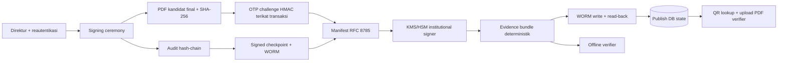

# TTE internal v2 — architecture and threat model

Status: implementasi adapter aplikasi. Profil production belum boleh diaktifkan sebelum seluruh gate pada `DEPLOYMENT_HANDOFF.md` disahkan.

## Data flow

Boundary kepercayaan: browser, mail organisasi, aplikasi, database, KMS, WORM, kanal public-key, dan operator/DBA adalah domain terpisah. QR hanya locator. OTP email memberi assurance identitas menengah dan tidak tahan phishing/mailbox takeover.

## ADR ringkas

- Manifest memakai JSON Canonicalization Scheme/RFC 8785 melalui library `root23/php-json-canonicalization`; float ditolak agar representasi bukti stabil.
- Hash file adalah SHA-256 atas byte PDF final yang telah dipratinjau. Manifest ditandatangani, bukan hash database yang dapat diedit sendiri.
- `EvidenceSigner` tidak menerima material private key dari database/filesystem aplikasi. Adapter test Ed25519 hanya aktif pada environment `testing`; production fail-closed sampai provider KMS/HSM/Vault tersedia.
- `ImmutableEvidenceStore` melakukan put, receipt, version, retention metadata, dan read-after-write. Adapter lokal hanya untuk automated test; production fail-closed tanpa WORM.
- OTP 8 digit/180 detik memakai HMAC-SHA-256 dengan secret terpisah dari `APP_KEY`, persistent limiter, binding user/session/document/version/PDF/manifest/action/ceremony, dan atomic consume.
- Audit adalah global append-only hash-chain dengan stream head terkunci, sequence/idempotency constraint, signed checkpoint, dan salinan checkpoint immutable.
- ZIP evidence deterministik adalah format portabel/offline. CMS/PAdES dan RFC 3161 belum diaktifkan; keduanya memerlukan keputusan terpisah dan bukan klaim profil ini.
- Revocation/supersede adalah event administratif baru. Manifest, signature, dan fakta historis lama tidak pernah ditulis ulang.

## Ancaman dan kontrol

| Ancaman | Kontrol | Batas residu |
|---|---|---|
| Replay/brute-force OTP | Binding penuh, TTL, attempt lock, limiter persisten, row lock | Mailbox/session compromise tetap mungkin |
| Admin DB mengubah PDF/hash | Signature manifest, bundle offline, audit checkpoint, WORM | Collusion lintas KMS/WORM/DB di luar kontrol aplikasi |
| QR disalin ke file palsu | UI tidak mengklaim file valid sebelum upload dan hash match | Pengguna harus benar-benar menjalankan pemeriksaan file |
| Kegagalan render/KMS/storage/DB | State machine, outbox, idempotency, fail-closed, read-back | Rekonsiliasi dan operator tetap diperlukan saat outage |
| Audit diedit/dihapus/disusun ulang | Previous hash, sequence, stream head, signed checkpoint | DBA yang juga menguasai semua anchor eksternal adalah risiko organisasi |
| Key dicabut/dirotasi | Registry berstatus active/retired/revoked dan pinned offline key | Kanal publikasi fingerprint resmi belum ditetapkan |
| Credential bocor dari source/log | Seeder tanpa password literal, placeholder kosong, structured redaction | Credential yang pernah terekspos wajib dirotasi di luar kode |

## Klaim yang diizinkan

“TTE Internal Terverifikasi—OTP, non-PSrE; assurance identitas menengah.” Jangan menyebut non-repudiation absolut, phishing-resistant, sertifikat personal, PAdES, atau setara PSrE.
